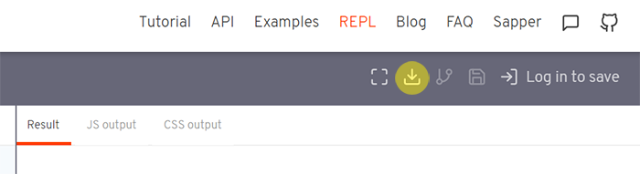

####

이 포스트는 [Svelte](https://svelte.dev/) 공식문서를 참고했습니다.

## 📁 REPL을 이용하여 설치

- 먼저 [이곳](https://svelte.dev/repl/hello-world?version=3.12.1)에서 svelte-app.zip 파일을 다운로드합니다.

####



####

- 압축을 해제한 뒤 터미널에서 해당 디렉토리로 이동합니다.

```sh
cd /path/to/svelte-app
```

- 패키지 파일을 설치합니다.

```sh
npm install
```

- 설치가 완료되면 아래의 명령어를 통해 개발모드를 실행합니다.

```sh
npm run dev
```

- localhost:5000에 접속하면 아래와 같은 화면을 확인할 수 있습니다.

####


####

## 📁 degit을 이용하여 설치

- 터미널에 다음과 같이 입력하여 새 svelte 프로젝트 디렉토리를 생성합니다.

```sh
npx degit sveltejs/template my-svelte-project
```

- 마찬가지로 해당 디렉토리로 이동해 패키지 파일을 설치한 뒤 개발모드를 실행합니다.

```sh
cd my-svelte-project
npm install
npm run dev
```
